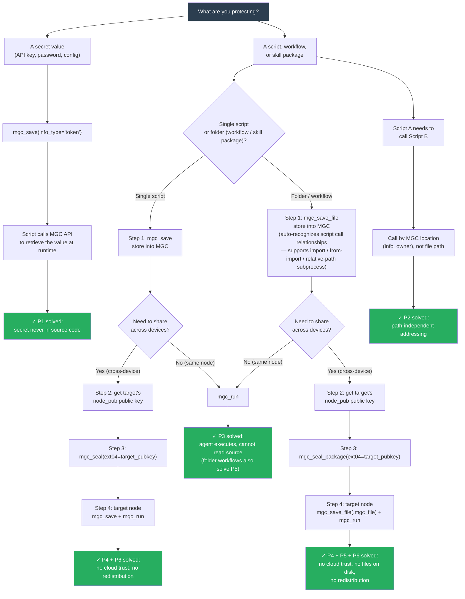

# 1. Overview — What MGC Blackbox Is

**MGC Blackbox is a Multi-Agent Cross-Node Privacy Execution Base.**

It is the encrypted execution layer *underneath* AI agents — not an agent itself. It lets AI agents, system scripts, and human users **store, execute, and delegate sensitive information, scripts, and entire workflows across trusted nodes without ever exposing plaintext.**

The core promise:

- **100% local, never touches the cloud.** All data, scripts, and encryption keys stay on your device. No third-party servers, no telemetry, no network calls outside localhost.
- **Store** sensitive data (tokens, passwords, configs) and scripts (logic, workflows, automation).
- **Execute** stored scripts with structured args and auto-detected dependencies. No rewrites, no path tricks, no plaintext on disk. 
- **Seal** scripts and workflow packages for cross-node delegation — the original owner keeps control, the target node can only execute.
- **Auto-recognize workflows** — MGC automatically discovers scripts' args, dependencies, compatible OS, and cross-script workflow relationships.（MGC treats source code as the workflow）
- **List** stored entries (metadata only, never plaintext).
- **Open WebUI** for human operations.

**Trust root.** MGC's trust root is your root key, set during first-time initialization and bound to the local device environment. It is not derived from any server, account, or third party. You can change the root key at any time, and you can migrate stored assets to another device — after migration, re-setting the root key keeps everything valid.

If the script has been sealed, it was encrypted by AES & RSA. **AI can execute but cannot read the plaintext.**

---

# 2. Problem List & Solution Map

> Read this section first. It maps the real-world problems MGC solves to the exact tools and steps you need.

---

## 2.1 Problem List

| # | Problem | Root cause | MGC solution |
|---|---------|------------|--------------|
| P1 | API keys, passwords, and tokens are hardcoded in script source. Anyone who reads the code — including AI agents — sees the secrets. | Secrets live in the same artifact as code. | Store secrets in MGC with `info_type="token"`. Scripts retrieve them at runtime via API by location name, never by plaintext value. |
| P2 | Script paths are hardcoded (`/home/alice/scripts/config.py`). Moving to another device or OS breaks execution. | Filesystem paths are not portable. | Address scripts by MGC location (`info_owner`), not by file path. The same `info_owner` resolves on any node where MGC has the entry. |
| P3 | Script source code is fully visible to AI agents and coworkers. Sensitive business logic can be read, copied, or modified. | No code-level isolation between agent and script. | Store scripts with `info_type="script"`. Agents call `mgc_run` — they can execute but cannot read the source. On the same node or across nodes. |
| P4 | Cross-device script authorization requires a cloud trust broker (OAuth provider, license server). This costs money, adds latency, and exposes your IP to a third party. | Trust root is external and centralized. | Local RSA key exchange + AES sealing. No cloud, no third party. The target node's public key is the only thing you need. |
| P5 | Multi-script workflows use `import` / `from-import` / `subprocess` with relative paths. On the target node, these imports fail because the local file structure doesn't exist. | Python's import system is bound to the local filesystem. | MGC auto-recognizes the import graph on save (`ext08`) and intercepts imports at runtime — routing them through sealed execution without files on disk. |
| P6 | A script you authorized for Node B can be re-distributed to Node C without your consent. Execution permission equals copy permission. | No cryptographic binding between execution right and node identity. | The AES key is wrapped with Node B's RSA public key. Node B can decrypt and execute, but cannot re-seal for Node C. |

---

## 2.2 Decision Flow

Follow the flow from top to bottom to find the exact tools and steps for your situation.



> **Note:** For the full list of auto-recognizable import/subprocess patterns (and what is *not* supported), see section 2.4 below.

---

## 2.3 API Call Pattern — The One Code Example You Need

When a script needs to retrieve a secret or invoke another script from MGC, it goes through the REST API. This is the only place where getting the details wrong will break things — so here is the complete pattern.

```python
import os, requests

# 1. Read MGC access token (fixed path, do not change)
with open(os.path.expanduser("~/.mgc/database/mgc_black_box/.mgc_token")) as f:
    MGC_TOKEN = f.read().strip()

# --- Usage A: Retrieve a secret value ---
resp = requests.post(
    "http://127.0.0.1:57219/api/mgc/sensitive/get",
    headers={"X-MGC-Token": MGC_TOKEN},
    json={"info_type": "token", "info_owner": "openai_api_key"},
)
resp.raise_for_status()
api_key = resp.json()["data"]  # plaintext key, in memory only — never written to disk

# --- Usage B: Invoke another stored script ---
resp = requests.post(
    "http://127.0.0.1:57219/api/mgc/sensitive/get",
    headers={"X-MGC-Token": MGC_TOKEN},
    json={
        "info_type": "script",
        "info_owner": "send_email",        # the called script's MGC location
        "diff_1": "send_email",
        "action": "run",                   # ← this field triggers execution
        "ext02": '["--to", "alice@example.com"]',  # runtime args as JSON array string
    },
)
result = resp.json()  # {"pid": 12345, "status": "started"}
```

**Five things to get right:**

| # | Detail | Correct value |
|---|--------|---------------|
| 1 | Token file path | `~/.mgc/database/mgc_black_box/.mgc_token` |
| 2 | Header name | `X-MGC-Token` |
| 3 | URL | `http://127.0.0.1:57219/api/mgc/sensitive/get` |
| 4 | Trigger execution | Add `"action": "run"` to the JSON body |
| 5 | Response data | `resp.json()["data"]` for secrets; `resp.json()` for run results |

---

## 2.4 Auto-Recognizable Workflow Patterns

When you save a folder with `mgc_save_file`, MGC statically parses every script to build the cross-script call graph (`ext08`). At runtime, MGC intercepts these patterns and routes them through sealed execution — **no files on disk, no plaintext, no rewrites**.

| Pattern | Code example | ext08 edge kind | Recognized? |
|---------|-------------|-----------------|-------------|
| `from` import | `from config import DEFAULT_CITY` | `from_import` | Yes |
| `from` import with alias | `from helpers.fetch import get_weather as gw` | `from_import` (asname preserved) | Yes |
| Plain `import` | `import helpers.parse` | `import` | Yes |
| Relative path via `Path` | `Path(__file__).parent / "config.py"` | `path` | Yes |
| Relative path via `open()` | `open("config.json")` against sibling file | `path` | Yes (recognition only in the current version; runtime routing is not yet supported) |
| Subprocess with relative path | `subprocess.run([sys.executable, str(Path(__file__).parent / "config.py"), ...])` | `path` (recognized via the `Path(...)` literal above; runtime also intercepts the subprocess call) | Yes — only when the caller and target were saved into MGC together as one workflow package. |
| Subprocess with literal list | `subprocess.run(['helper.py', '--x'])` (or `from subprocess import run; run([...])`) | `subprocess` (`callee` field records which subprocess function: `run` / `Popen` / `call` / `check_call` / `check_output`) | Yes — same package rule as above. Runtime interception runs the helper as sealed subprocess. |
| Dynamic import | `importlib.import_module(module_name)` | — | No — MGC statically parses only string literals; dynamic names are not recognized. At runtime, Python's standard import will attempt to resolve the name (typically fails with `ModuleNotFoundError`). |
| Absolute path | `open("/Users/alice/scripts/config.py")` | — | No — absolute paths are not portable and cannot be sealed. Use MGC location addressing instead. |
| Cross-subdirectory relative path | `subprocess.run([..., "../y.py"])` or `Path(__file__).parent.parent / "y.py"` when `..` resolves outside the caller's directory | — | No — see Scope below. |
| Function-level call without import | A function defined in another file called only by reference (no `import` / `from-import` / literal `Path` referencing it) | — | No — the parser only inspects string literals reachable via the conventional forms above. |

> **Note on `open()` relative paths**: MGC can *recognize* `open("config.json")` against sibling files (stores the edge in `ext08`), but runtime routing for `open()` is not yet supported. The file will be resolved through the standard filesystem at runtime, which means it must exist on disk on the target node. If you need fully sealed execution for config access, read the config inside your script logic rather than via `open()` on a separate file.

**Scope (1.5.2+):**

- ✅ Cross-script calls are recognized **within the same folder** (`info_owner + diff_2` of the caller and the callee must be identical).
- ❌ **Same folder, different subdirectory** (e.g. `pkg_root/CROSS-FOLDER/x.py → ../y.py`) — not recognized. The parser treats `..` as out-of-scope, so `ext08` will not contain the edge. Place helpers and drivers in one directory.
- ❌ **Function-level calls** that don't appear as `import` / `from-import` / `Path` literals in source — not recognized.

**Key invariants:**

- The `argparse` on each script is independent — the driver's args go to the driver's `ext02`, each helper's args go to the helper's own `ext02`.
- `Path(__file__).parent / "x.py"` resolves correctly on macOS, Linux (POSIX), and Windows (`\` separator) — MGC normalizes via `_normalize_path` in `subprocess_adapter`.
- Subprocess output flows through normally — `capture_output=True, text=True` works because the launched helper is a real Python interpreter with UTF-8 decoding.

**Limits.** The cross-script call only works when both scripts are saved together. To orchestrate scripts across different packages, use the REST API pattern in section 2.3 — pass the MGC location (`info_owner`) of the target script.

---

## 2.5 Cross-Node Handshake — Sequence

When distributing sealed scripts or packages to another MGC node, follow this sequence:

```
You (Node A)                              Target Node B
─────────────                             ─────────────
                                         1. mgc_get(info_type="__NODE_PUB__")
                                            → returns Node B's RSA public key (PEM)

2. Receive the PEM string
   from Node B via any channel
   (email, chat, Git, ...)

3. Seal the script or package:
   ┌─ Single script ──────────────────────┐
   │ mgc_seal(                            │
   │   info_owner="my_report",            │
   │   ext04=<Node B's PEM>,              │
   │   info_type="script",                │
   │ )                                    │
   ├─ Folder package ────────────────────┤
   │ mgc_save_file(path="./my_workflow", │
   │   info_owner="my_workflow",          │
   │   diff_2="my_workflow")              │
   │ mgc_seal_package(                    │
   │   info_owner="my_workflow",          │
   │   diff_2="my_workflow",              │
   │   ext04=<Node B's PEM>,              │
   │ )                                    │
   └──────────────────────────────────────┘

4. Send the sealed capsule / .mgc_file
   to Node B

                                          5. Node B imports and runs:
                                             mgc_save_file(path="package.mgc_file")
                                             mgc_run(info_owner="my_report")
                                             → Node B decrypts with its private key
                                             → script executes, source never exposed
```

**Before `mgc_run` on the target node**, verify:

- Dependencies in `ext05` are installed on Node B
- The OS in `ext06` is in the supported list

Otherwise the script may fail at runtime with `DEP_MISSING` or `PLATFORM_INCOMPAT`.

---

# 3. Installation & Runtime — How to Install and Run MGC

## 3.1 Requirements

- An MCP-compatible agent runtime (Claude Desktop, Cursor, Trae, etc.) for AI integration.
- A modern browser for WebUI access — also used for first-time setup (entering the **root key** that encrypts the local database) and for changing the root key later.

### Supported Python x OS matrix 

| OS | Python 3.10 | Python 3.11 | Python 3.12 |
|---|---|---|---|
| Windows | Yes | Yes | Yes |
| Linux (Ubuntu) | Yes | Yes | Yes |
| macOS 14+ (Apple Silicon) | Yes | Yes | Not supported |

## 3.2 Install MGC Blackbox

```bash
pip install mgc-blackbox
```

Ensure installation happens in the same Python environment where your MCP agent runs.

> **First-run setup.** On the first startup after install, MGC prompts you to set a personal key and weight parameter. Three options:
>
> | Mode | Who uses it | How |
> |------|------------|-----|
> | CLI — auto-generate | Agent / automated setup | MGC generates a strong random key. Zero human intervention. |
> | CLI — custom input | Developer who wants a known key | Enter your own key string at the prompt. |
> | WebUI | Human who wants a GUI | Open browser, enter key in the form. |
>
> **For agent-driven installations**: use CLI auto-generate. 

> **Migrating to another machine.** Copy the local database (default `~/.mgc/database/mgc_black_box/mgc_black_box.db`) to the new machine, install MGC Blackbox there, and on first startup provide the same personal key and weight parameter. If the original key was auto-generated, retrieve it from `~/.mgc/secrets/personal _key.txt` on the source machine.
>
> If protection mode is enabled on the source machine, disable it before migrating.

## 3.3 Run MGC in normal mode

Start MGC as a standalone local service:

```bash
mgc
```

Default behavior:

- Starts HTTP server at `http://127.0.0.1:57219`
- Initializes encrypted database on first run
- Generates access token at `~/.mgc/database/mgc_black_box/.mgc_token`

This token is required for all REST API calls.

## 3.4 Run MGC as an MCP server

If your agent supports MCP, configure:

```json
{
  "mcpServers": {
    "mgc-blackbox": {
      "command": "mgc",
      "args": ["--mcp"],
      "env": { "PYTHONIOENCODING": "utf-8" }
    }
  }
}
```

In MCP mode, MGC exposes the tools listed in section 6. The REST API remains available for system scripts.

### Sandbox mode

MGC supports sandboxed environments, but some sandbox agents run MCP in the system environment rather than inside the sandbox. To use the MCP tools, install MGC in the system environment, or call the FastAPI directly.

## 3.5 WebUI access

WebUI is available at:

```
http://127.0.0.1:57218
```

Use the WebUI for initialization, manual storage, metadata inspection, database audit, and logs.

---

# 4. Invocation Model — Who Uses MGC and How

| Caller | Channel | Typical use |
|--------|---------|-------------|
| AI agent | MCP tools | Store / retrieve / run / seal / seal-package via structured function calls |
| System script or Sandboxed agents | REST API | Embed MGC lookups in CI jobs, scheduled tasks, internal services |
| Human | WebUI | First-time setup, manual entry, audit, deletion, logs |

---

# 5. The `ext_*` Protocol — Field Meanings

| Field | Role |
|-------|------|
| **ext01** | Startup command (e.g. `"python"`). Required for scripts at `mgc_save`; consumed by `mgc_run`. |
| **ext02** | Runtime args as a JSON array string, e.g. `'["--start", "2026-08-08"]'`. Auto-filled by the `argparse` parser on `mgc_save`; can be overridden per `mgc_run`. Passed to `subprocess.run()` verbatim. |
| **ext03** | Sealed AES key (RSA-encrypted). Set by `mgc_save` after `mgc_seal` / `mgc_seal_package`; consumed by `mgc_run` for sealed scripts. |
| **ext04** | Target node public key (PEM). Required only when sealing (`mgc_seal` / `mgc_seal_package`). |
| **ext05** | Third-party dependency list (JSON array, e.g. `["requests","yaml"]`). Auto-filled from Python AST / Node.js imports for `info_type=script` and for every script inside a folder package; caller-supplied values take priority. **MGC does NOT install dependencies** — displayed as runtime advisory only. |
| **ext06** | Compatible platform list (JSON array, e.g. `["windows","macos","linux"]`). Auto-filled from path patterns + platform condition branches; static inference only. Same auto-fill rules as `ext05`. |
| **ext07** | Source node public key (PEM). Auto-populated by `mgc_seal_package` and recorded in `MGCFILE.json` for provenance. You do not set it manually. |
| **ext08** | Cross-script call graph. Auto-populated by `mgc_save_file` / `mgc_save` on folder save — MGC statically analyzes each script and records how they reference each other (imports, relative paths, subprocess calls). Consumed at runtime to route cross-script calls through sealed execution — no plaintext on disk, no path tricks. You do not set it manually. For the full list of recognizable patterns, see section 2.4. |

---

# 6. MCP Tools — Quick Reference

> For full argument schemas, field types, and return shapes, see the MCP server's auto-generated schema (every MCP client surfaces it; AI agents read it directly).

## 6.1 REST API — System / Script Integration

For system scripts and CI integrations that cannot use MCP.

**Base URL:** `http://127.0.0.1:57219`
**Header:** `X-MGC-Token: <token>` (token file: `~/.mgc/database/mgc_black_box/.mgc_token`)

| Endpoint | Body / params | Purpose |
|----------|---------------|---------|
| `POST /api/mgc/sensitive/save` | `info_type`, `info_owner`, `content`, `ext01`-`ext07`, `diff_1`-`diff_3` | Store an entry. **`info_type="script"`** → `content` is the script body. **`info_type="file"`** → `content` is the **absolute path to a local folder** (MGC scans it and auto-fills per-script `ext01`/`ext02`/`ext05`/`ext06`). **`info_type="file"` + `content` ending in `.mgc_file`** → import a sealed package from another MGC node. **Path-aware "I have a file on disk" save is exposed only via the MCP tool `mgc_save_file`** (not as a separate REST endpoint); for direct API use, read the file yourself and POST to `/api/mgc/sensitive/save` with the actual content string. |
| `POST /api/mgc/sensitive/get` | `info_type`, `info_owner`, `diff_1`-`diff_3`, optional `action` | Retrieve / list / operate on an entry. See `action` values below. |
| `POST /api/mgc/sensitive/get` | empty body | List all stored entries (metadata only) |
| `POST /api/mgc/sensitive/get` | `action="run"` + `info_type="script"` | Execute a stored script (mirror of `mgc_run`). Returns `pid + status`. |
| `POST /api/mgc/sensitive/get` | `action="package"` + `info_type="file"` | Export a stored folder as a plaintext archive (mirror of `mgc_package`). |
| `POST /api/mgc/sensitive/get` | `action="seal_package"` + `info_type="file"` + `ext04=<target node PEM>` | Seal a folder package for another node (mirror of `mgc_seal_package`). |

> **No interactive API docs** — MGC explicitly disables `/docs` and `/redoc` for security. For full request / response shapes, see the MCP server schema (MCP clients surface it directly to AI agents; for direct API use, see the source code in `mgc/presentation/web/router/`).

---

# 7. Trigger Rules — When AI Should Use Which Tool

| User intent | Reach for |
|-------------|-----------|
| "Save this token / password / script body / config string" | `mgc_save` |
| "Save this script file / config file on disk" | `mgc_save_file` (single file path) |
| "Save this whole skill / workflow folder" | `mgc_save_file` (folder path → `info_type="file"`) |
| "Import a sealed package from another node" | `mgc_save_file` (`.mgc_file` path) |
| "Run my script X" | `mgc_run` (preferred) |
| "What do I have stored?" | `mgc_list` |
| "Find entries matching X" (fuzzy) | `mgc_find` |
| "Seal this script for node B" | `mgc_seal` |
| "Export this workflow folder" | `mgc_package` (plaintext archive) |
| "Hand off this workflow to another MGC node" | `mgc_seal_package` |
| "Open the interface" | `mgc_open_webui` |
| "Read the value of entry X" | `mgc_get` |

---

# 8. Script Args — Auto-extracted, Override When Needed

When you save a Python script with `info_type='script'`, **MGC automatically parses the script's `argparse` and assembles default args into `ext02`**.

**Dependencies are also auto-detected** — `ext05` is populated from the script's imports (Python AST and Node.js imports) so the consumer knows what's needed. MGC does **not** install dependencies at runtime; if a required package is missing on the target node, `mgc_run` returns `DEP_MISSING` (see section 11). Install the listed packages manually before running.

**Dynamic args need manual fill-in.** `ext02` must be a valid JSON array string. Each element is one argv token.

**At runtime**, override the stored args via:

- MCP: `mgc_run(info_owner=..., ext01=..., ext02='["--start", "2026-12-25"]')`
- WebUI: click the amber **Run with Args** button to edit JSON before launching

---

# 9. Security Model — How MGC Protects Data

- **All data is encrypted locally** (AES-256 at rest).
- **AI can execute but cannot read sealed plaintext.**
- **Seal is irreversible**: once sealed, the original owner can re-seal with a new key but cannot extract the script back.
- **Execution rights do not equal ownership**: a sealed node can execute but cannot transfer the capsule to a third node.
- **Content never leaves the device in plaintext.**
- **Script execution happens inside the encrypted boundary** — subprocess inherits the encrypted state.
- **Folder packages inherit single-script guarantees**: every file in a `.mgc_file` is encrypted; the receiving node learns only the file *structure* (paths, dependencies, platforms) before running.

---

# 10. Delete Policy

Delete functionality is available **via WebUI only** to prevent accidental AI-driven deletion.

---

# 11. Error Handling

| Status | Meaning | AI action |
|--------|---------|-----------|
| `NOT_FOUND` | Entry not found | Use `mgc_list` or ask user |
| `MULTIPLE_MATCHES` | Partial match | Present filtered list to user, ask for refinement |
| Connection failed | MGC not running | MCP auto-starts (or instruct user to run `mgc`) |
| Initialization required | First-time setup | Call `mgc_open_webui` |
| `args_not_recognized` | Script `argparse` parser couldn't identify default args | Verify script has `add_argument(..., default=<literal>)` |
| `dynamic_args_detected` | Script has computed defaults MGC cannot statically evaluate | Re-save with literal defaults, or supply `ext02` manually |
| `MISSING_REQUIRED_FIELDS` (ext04) | `mgc_seal` or `mgc_seal_package` called without target node public key | First call `mgc_get(NODE_PUB)` on the target node to retrieve its PEM public key, then pass it as `ext04` |
| `DIFF2_MISMATCH` | Cross-script `from-import` referenced a script outside the caller's workflow package (i.e., not saved together in the same `mgc_save_file`) | Re-save both scripts together as one workflow package, or use the API-call pattern (section 2.3) for cross-package orchestration |
| `DEP_MISSING` | Required Python / Node dependency not installed on target | Install before `mgc_run`; MGC lists the missing deps from `ext05` in the error body |
| `PLATFORM_INCOMPAT` | `ext06` lists only incompatible OS for current host | Re-`mgc_save` on a host of a listed platform, or extend the workflow's platform branch |

---

# 12. Coming Next

We are preparing **batch chain authorization** — trusted nodes join a private chain for automated cross-node collaboration, no central broker needed. Send your node_pub to mirgincipher@outlook.com to claim a free first-batch trial.
