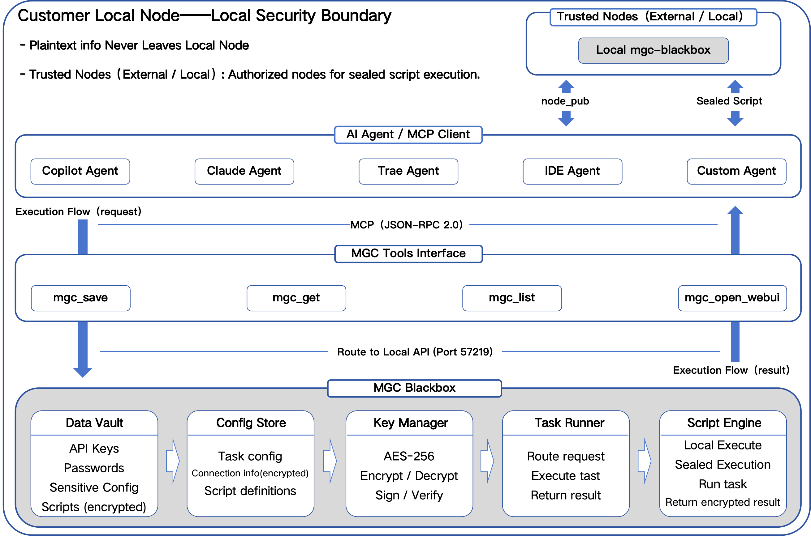

# **MirginCipher Blackbox (MGC)** — Encrypted AI Agent Execution Layer

A secure local execution layer for AI agents — encrypted storage, sealed scripts, zero plaintext leakage.  
Protect API keys, credentials, and scripts from AI agents with AES‑256 + RSA hybrid encryption and a Cython‑compiled secure core.


---

## **What is MGC Blackbox?**

MirginCipher Blackbox (MGC) is a **Local Encrypted Execution Layer** designed to protect sensitive human intent and enable **secure, deterministic AI execution**.  
It provides a trusted device‑level encrypted boundary for agents — **MGC is not an agent itself**.

MGC ensures:

- Sensitive data never leaves the device  
- AI agents cannot access plaintext  
- Scripts execute inside a sealed, encrypted environment  
- Cross‑node execution is possible without exposing code  

---

## **Why MGC?**

- 🔐 **End‑to‑End Encrypted Storage**  
  AES‑256 encrypted vault for API keys, credentials, configs — never exposed to AI agents or external systems.

- 🧱 **Local‑First Security Boundary**  
  All execution and decryption happen on‑device. No cloud dependency, no plaintext leakage, no telemetry.

- 🧩 **Sealed Script Execution (Unique)**  
  Convert scripts into unreadable execution capsules.  
  Only trusted nodes can decrypt & run them — even the sender cannot read sealed scripts.

- ⚡ **Deterministic Local Execution**  
  Stable, reproducible behavior across macOS / Linux / Windows with a Cython‑compiled secure core.

- 🛠️ **Native MCP / Skill Integration**  
  Exposes mgc_save / mgc_get / mgc_list / mgc_seal / mgc_open_webui as standard MCP tools.  
  Works out‑of‑the‑box with Copilot, Claude, Trae, IDE Agents.

- 🔄 **Zero Integration Cost**  
  Any MCP‑compatible agent can immediately use MGC as its secure execution backend — no SDK, no custom code.

- 🛡️ **Designed for AI Agent Security**  
  Protects human intent, prevents agent overreach, and enforces strict execution boundaries.

---

## **Use Cases**

### **1. Protect API Keys & Credentials from AI Agents**  
Store secrets encrypted. Agents can use them, but never see plaintext.

### **2. Secure Local Automation**  
Run Python / Shell / Node scripts locally without exposing sensitive data to AI logs or cloud systems.

### **3. Sealed Script Distribution**  
Share scripts with collaborators or devices **without exposing source code** — they can execute but cannot read.

### **4. Cross‑Node Execution**  
Send sealed scripts to trusted remote nodes:
- Sender cannot read the sealed content  
- Recipient cannot read the sealed content  
- Only the target node can decrypt and execute  

Ideal for enterprise automation, multi‑node collaboration, and privacy‑sensitive workflows.

### **5. Local‑First AI Agent Security Boundary**  
Provides a local security layer for Copilot / Claude / Trae / IDE Agents:
- Local encrypted storage  
- Local execution  
- Local permission control  
- No cloud dependency  

### **6. Privacy‑Preserving AI Workflows**  
Enables financial automation, personal data processing, and enterprise internal workflows with privacy protection.

---

## **Architecture**

<p align="center">
  
</p>

---

## **Crypto Layer & Performance**

MGC uses a **hybrid cryptographic design**:

- **AES‑256‑GCM** — bulk data encryption (vault items, sealed script payloads)  
- **RSA‑2048/4096** — key encapsulation, node authorization, cross‑node execution rights  

The crypto_layer is **Cython‑compiled** to:

- Improve AES and especially RSA performance  
- Reduce Python‑level overhead for large integer arithmetic  
- Provide a sealed, tamper‑resistant execution boundary  
- Prevent monkey‑patching and unauthorized modification  
- Maintain deterministic behavior across nodes  

**Security does not rely on code being hidden.**  
We rely on standard cryptographic primitives and a clear threat model.  
Compilation reduces attack surface and improves performance — not “security through obscurity”.

---

## **Features**

- **Local encrypted storage**  
  Sensitive data is encrypted and never uploaded to the cloud.

- **Encrypted execution**  
  Scripts run inside the encrypted boundary; plaintext is never exposed to AI or external systems.

- **Store‑once authorization**  
  Items can be reused within the same device environment without repeated confirmation.

- **Environment migration**  
  If hardware changes, access can be restored using a user‑defined migration key.

- **Cross‑agent availability**  
  Any agent platform supporting Skills / MCP can integrate with MGC with zero additional development.

- **Cross‑platform support**  
  Distributed as a Python package with security‑critical components compiled via Cython.

- **No delete function**  
  MGC treats all stored info as user assets.  
  To delete: use WebUI → Database Audit → manually delete via DB Browser.

- **Script Sealing (Cross‑Node Execution Rights)**  
  MGC can **seal scripts** into non‑readable execution capsules:  
  - Ownership remains with the user  
  - Execution rights can be granted to trusted external nodes  
  - Only the target node can decrypt & execute  
  - Sender cannot read sealed script contents  
  Enables **secure cross‑node execution without plaintext exposure**.

---

## **Quick Start**

```bash
pip install mgc-blackbox
mgc
```

WebUI URL:

```
http://127.0.0.1:<port>
```

Default port: **57218**  
If occupied, MGC automatically decrements (`57217`, `57216`, …).

---

## **Example: Save & Retrieve Secrets**

```python
from mgc import save, get

save("openai_key", "sk-xxxx")
print(get("openai_key"))
```

---

## **MCP Integration**

MGC exposes a local MCP tools interface:

- `mgc_save`  
- `mgc_get`  
- `mgc_list`  
- `mgc_seal`  
- `mgc_open_webui`  

Compatible with:

- Copilot Agent  
- Claude Agent  
- Trae Agent  
- IDE Agents  
- Custom Agents  

MCP configuration file:  
`mcp_config.json` (auto‑generated on installation)

---

## **Usage Overview**

### **1. Through AI agents (Skills / MCP)**  
Agents can:

- Store sensitive information  
- Retrieve encrypted items  
- Execute stored scripts  
- **Seal scripts for trusted nodes (external / local)**  
- All without unauthorized plaintext access  

### **2. Through system scripts (REST API)**  
External scripts can fetch encrypted items at runtime.  
Plaintext is never exposed to AI logs or external systems.

For detailed usage:  
**MGC_GUIDE.md**

---

## **Security Model**

- All data remains local  
- No cloud upload  
- No plaintext logging  
- Deterministic execution  
- User‑controlled authorization  
- Protection Mode for high‑security environments  
- Minimal network usage (only version & health checks)

For safety details:  
`docs/user_notice.md`

---

## **AI Skill Specification**

For AI behavior boundaries and tool definitions:  
`docs/skill_spec.md`

---

## **Authorization**

Integration into any third‑party products or AI agents is free of charge,  
but requires official authorization to ensure ecosystem integrity and security.

For authorization requests:  
**zkeviny@icloud.com**

---

## **License**

See the LICENSE file for full terms.

© 2026 MirginCipher Team. All rights reserved.
```

---
