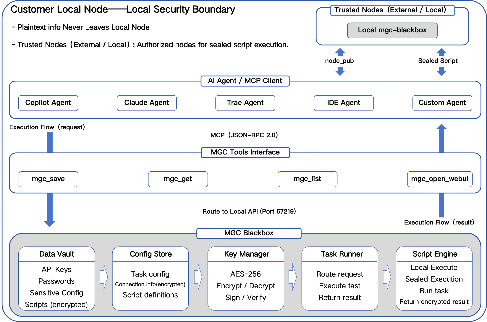

# **MirginCipher Blackbox (MGC)** — Multi-Agent Cross-Node Privacy Execution Base

A local encrypted execution base for **multi-agent, cross-node, privacy-preserving task execution** — sensitive operations never leave the device in plaintext; scripts, files, and skill / workflow folders can be sealed and dispatched across trusted nodes without exposing source code.


> 📌 **Roadmap:** [MGC Blackbox — 2026 Development Plan](https://github.com/zkeviny/MGC-Blackbox/issues/4)
---

## **What is MGC Blackbox?**

MirginCipher Blackbox (MGC) is a **Multi-Agent Cross-Node Privacy Execution Base**. It is **not an agent itself** — it is the encrypted execution layer underneath your agents.

MGC provides:

- A local encrypted execution base for AI agents, system scripts, and human users
- Cross-node task delegation via sealed, node-bound script capsules
- Zero plaintext leakage: secrets stay inside the encrypted boundary
- A trusted device-level boundary shared by Copilot / Claude / Trae / IDE Agents  

---

## **Why MGC?**

- 🔐 **End‑to‑End Encrypted Storage**  
  AES‑256 encrypted vault for API keys, credentials, configs — never exposed to AI agents or external systems.

- 🧱 **Local‑First Security Boundary**  
  All execution and decryption happen on‑device. No cloud dependency, no plaintext leakage, no telemetry.

- 🧩 **Sealed Script & Folder Execution (Unique)**  
  Convert scripts, files, and skill / workflow folders into unreadable, node-bound execution capsules.  
  Only the target node can decrypt & run them — neither sender nor third parties can read the source.

- ⚡ **Deterministic Local Execution**  
  Stable, reproducible behavior across macOS / Linux / Windows with a Cython‑compiled secure core.

- 🛠️ **Native MCP / Skill Integration**  
  Exposes mgc_save / mgc_get / mgc_list / mgc_run / mgc_find / mgc_package / mgc_seal_package / mgc_open_webui as standard MCP tools.  
  Works out‑of‑the‑box with Copilot, Claude, Trae, IDE Agents.

- 🔄 **Zero Integration Cost**  
  Any MCP‑compatible agent can immediately use MGC as its secure execution backend — no SDK, no custom code.

- 🛡️ **Designed for AI Agent Security**  
  Protects human intent, prevents agent overreach, and enforces strict execution boundaries.

---

## **Use Cases**

### **1. Protect API Keys & Credentials from AI Agents**  
Store secrets encrypted. Agents can use them, but never see plaintext.

### **2. Secure Local Automation**  
Run Python / Shell / Node scripts locally without exposing sensitive data to AI logs or cloud systems.

### **3. Sealed Script Distribution**  
Share scripts with collaborators or devices **without exposing source code** — they can execute but cannot read.

### **4. Cross‑Node Execution**  
Send sealed scripts to trusted remote nodes:
- Sender cannot read the sealed content  
- Recipient cannot read the sealed content  
- Only the target node can decrypt and execute  

### **5. Local‑First AI Agent Security Boundary**  
Provides a local security layer for Copilot / Claude / Trae / IDE Agents.

### **6. Privacy‑Preserving AI Workflows**  
Enables financial automation, personal data processing, and enterprise internal workflows with privacy protection.

### **7. Skill / Workflow Folder Sealing**  
Bulk-import a skill / workflow folder via `mgc_save(info_type='file', content=<local folder path>)`, then ship it as a sealed `.mgc_file` via `mgc_seal_package` — the recipient node decrypts and runs each script in its own encrypted boundary, with no source code exposure.

---

## 📘 **Value Scenarios**

MGC Blackbox provides a **trusted, encrypted execution boundary** for different roles and environments.  
Detailed scenario documents:

- 🔐 **Sensitive Credentials Authorization**  
  [docs/Sensitive_Credentials_Authorization.md](docs/Sensitive_Credentials_Authorization.md)

- 🧠 **Encrypted Cognitive Script Execution**  
  [docs/Encrypted_Cognitive_Script_Execution.md](docs/Encrypted_Cognitive_Script_Execution.md)

- 🌐 **Cross‑Node Execution Grant (Encrypted Capability Sharing)**  
  [docs/Cross‑Node_Execution_Grant%20(Encrypted_Capability_Sharing).md](docs/Cross‑Node_Execution_Grant%20(Encrypted_Capability_Sharing).md)

---

## **Architecture**

<p align="center">
  
</p>

---

## **Crypto Layer & Performance**

MGC uses a **hybrid cryptographic design**:

- **AES‑256‑GCM** — bulk data encryption  
- **RSA‑2048/4096** — key encapsulation & node authorization  

The crypto layer is **Cython‑compiled** to:

- Improve AES & RSA performance  
- Reduce Python overhead  
- Provide a sealed, tamper‑resistant execution boundary  
- Maintain deterministic behavior across nodes  

---

## **Features**

- Local encrypted storage  
- Encrypted execution  
- Store‑once authorization  
- Environment migration  
- Cross‑agent availability  
- Cross‑platform support  
- No delete function (manual DB deletion only)  
- Script sealing for cross‑node execution  

---

## **Quick Start**

### **1. Install**

```bash
pip install mgc-blackbox
```

### **2. Start Service**

```bash
mgc
```

### **3. Open WebUI**

```
http://127.0.0.1:57218
```

### **4. Store a Secret**

```python
from mgc import save
save("openai_key", "sk-xxxx")
```

### **5. Execute Scripts Securely**

Scripts run inside MGC's encrypted boundary.

---

## **Example: Save & Retrieve Secrets**

```python
from mgc import save, get

save("openai_key", "sk-xxxx")
print(get("openai_key"))
```

---

## **MCP Integration**

MGC exposes a local MCP tools interface:

- `mgc_save` — store secrets, scripts, files, or folder snapshots  
- `mgc_get` — retrieve encrypted content  
- `mgc_list` — browse stored entries  
- `mgc_run` — execute a stored script in the encrypted boundary  
- `mgc_find` — fuzzy-search entries by `info_type` / `info_owner` / `diff_1..3`  
- `mgc_package` — bundle a folder into a sealed `.mgc_file`  
- `mgc_seal_package` — ship a sealed package to a trusted node  
- `mgc_open_webui` — open the local WebUI  

Compatible with Copilot, Claude, Trae, IDE Agents.

---

## **Usage Overview**

### **1. Through AI agents (Skills / MCP)**  
Agents can store secrets, retrieve encrypted items, execute scripts, and seal scripts.

### **2. Through system scripts (REST API)**  
External scripts can fetch encrypted items at runtime.

---

## **Security Model**

- All data remains local  
- No cloud upload  
- No plaintext logging  
- Deterministic execution  
- User‑controlled authorization  
- Sandbox mode support (fallback hardware fingerprint for restricted environments)  

---

## **AI Skill Specification**

See: `docs/skill_spec.md`

---

## **Authorization**

Integration into any third‑party products or AI agents is free,  
but requires official authorization to ensure ecosystem integrity.

Contact: **mirgincipher@outlook.com**

---

## **License**

See the LICENSE file for full terms.

© 2026 MirginCipher Team. All rights reserved.
```

---
